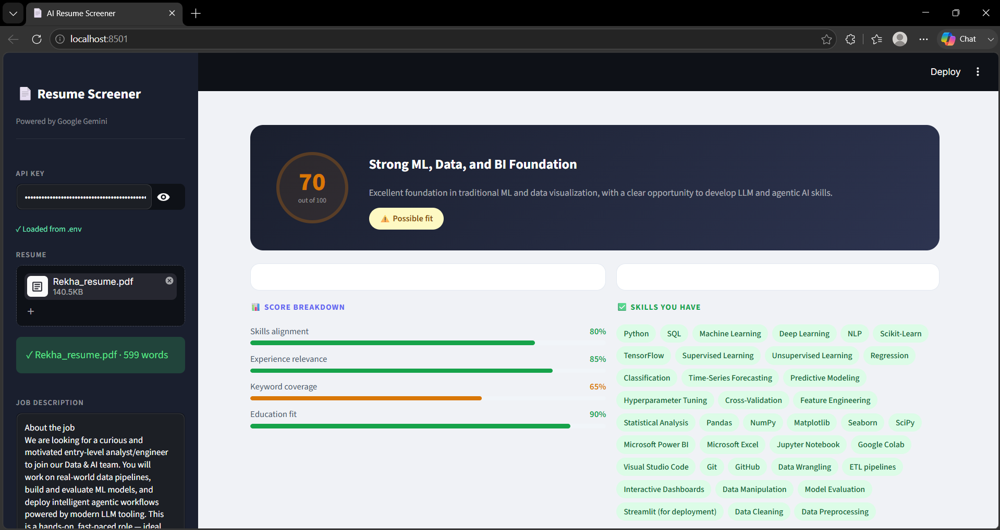

<div align="center">

# 📄 AI Resume Screener

**An intelligent ATS-style resume analyzer powered by Google Gemini 2.5 Flash**

[](https://www.python.org/)
[](https://streamlit.io/)
[](https://aistudio.google.com/)
[](LICENSE)

[](https://ai-resume-screener-dnhfhtstcu3wr2wmm3ea3c.streamlit.app/)



</div>

---

## ✨ Features

- 📤 **File upload support** — PDF, DOCX, and TXT resume formats
- 🤖 **AI-powered analysis** — uses Google Gemini 2.5 Flash for deep resume-JD matching
- 📊 **Match score (0–100)** — overall compatibility score with breakdown by category
- 🟢 **Skill gap analysis** — matched, partial, and missing skills highlighted
- 💡 **Actionable suggestions** — concrete tips to improve your resume for the role
- 🎨 **Clean sidebar UI** — inputs on the left, results on the right
- 🔒 **Privacy-first** — your API key and resume never leave your machine (except to Google's API)

---

## 🖥️ Demo

| Section | What you get |
|---|---|
| **Overall score** | 0–100 match percentage with Strong / Possible / Weak fit verdict |
| **Score breakdown** | Skills · Experience · Keywords · Education sub-scores |
| **Skills you have** | Keywords from the JD found in your resume |
| **Partial matches** | Skills mentioned but not strongly demonstrated |
| **Missing skills** | Required JD skills absent from your resume |
| **Improvement tips** | 4 concrete, actionable resume edits |

---

## 🚀 Getting Started

### Prerequisites

- Python 3.10 or higher
- A free Google Gemini API key → [aistudio.google.com/apikey](https://aistudio.google.com/apikey)

### Installation

```bash
# 1. Clone the repository
git clone https://github.com/your-username/ai-resume-screener.git
cd ai-resume-screener

# 2. Install dependencies
pip install -r requirements.txt

# 3. Set up your API key
cp .env.example .env
# Open .env and paste your Gemini API key
```

### Running the app

```bash
streamlit run app.py
```

The app opens automatically at **http://localhost:8501**

---

## ⚙️ Configuration

Create a `.env` file in the project root (copy from `.env.example`):

```env
GEMINI_API_KEY=AIzaYourKeyHere
```

> **Note:** The `.env` file is listed in `.gitignore` and will never be committed to Git.  
> You can also paste your key directly in the app's sidebar without a `.env` file.

---

## 🗂️ Project Structure

```
ai-resume-screener/
├── app.py              ← Main Streamlit application
├── requirements.txt    ← Python dependencies
├── .env.example        ← API key template
├── .gitignore          ← Excludes .env and cache files
└── README.md           ← This file
```

---

## 🛠️ Tech Stack

| Layer | Technology | Purpose |
|---|---|---|
| **UI** | [Streamlit](https://streamlit.io/) | Browser-based app interface |
| **AI** | [Google Gemini 2.5 Flash](https://aistudio.google.com/) | Resume analysis & scoring |
| **PDF parsing** | [pdfplumber](https://github.com/jsvine/pdfplumber) | Layout-aware PDF text extraction |
| **DOCX parsing** | [python-docx](https://python-docx.readthedocs.io/) | Word document text extraction |
| **API client** | [google-genai](https://pypi.org/project/google-genai/) | Google Gemini SDK |
| **Config** | [python-dotenv](https://pypi.org/project/python-dotenv/) | Secure API key management |

---

## 📖 How It Works

```
Resume (PDF/DOCX/TXT)
        │
        ▼
 Text Extraction          ← pdfplumber / python-docx
        │
        ▼
 Prompt Engineering       ← Resume + JD injected into structured prompt
        │
        ▼
 Gemini 2.5 Flash API     ← Returns structured JSON analysis
        │
        ▼
 JSON Parsing             ← Score, skills, suggestions extracted
        │
        ▼
 Streamlit UI             ← Results rendered with progress bars & badges
```

---

## 🔒 Privacy & Security

- Your resume text and job description are sent **only to Google's Gemini API** for analysis
- Your API key is stored **locally in `.env`** and never transmitted anywhere else
- No data is stored, logged, or persisted between sessions
- Free tier usage may be used by Google to improve their models (per their [terms](https://ai.google.dev/gemini-api/terms))

---

## 📦 Deploying to Streamlit Cloud

1. Push this repo to GitHub
2. Go to [share.streamlit.io](https://share.streamlit.io/) and connect your repo
3. Under **Advanced settings → Secrets**, add:
   ```
   GEMINI_API_KEY = "AIzaYourKeyHere"
   ```
4. Click **Deploy** — your app will be live at a public URL

> Streamlit Cloud's secrets manager replaces the `.env` file for deployed apps.

---

## 🤝 Contributing

Contributions are welcome! Feel free to open an issue or submit a pull request for:

- Supporting more file formats (e.g. `.odt`, image-based PDFs via OCR)
- Adding a comparison history feature
- Exporting the analysis as a PDF report
- Multi-language support

---

## 📄 License

This project is licensed under the MIT License — see the [LICENSE](LICENSE) file for details.

---

<div align="center">
Built with ❤️ using Streamlit & Google Gemini
</div>
